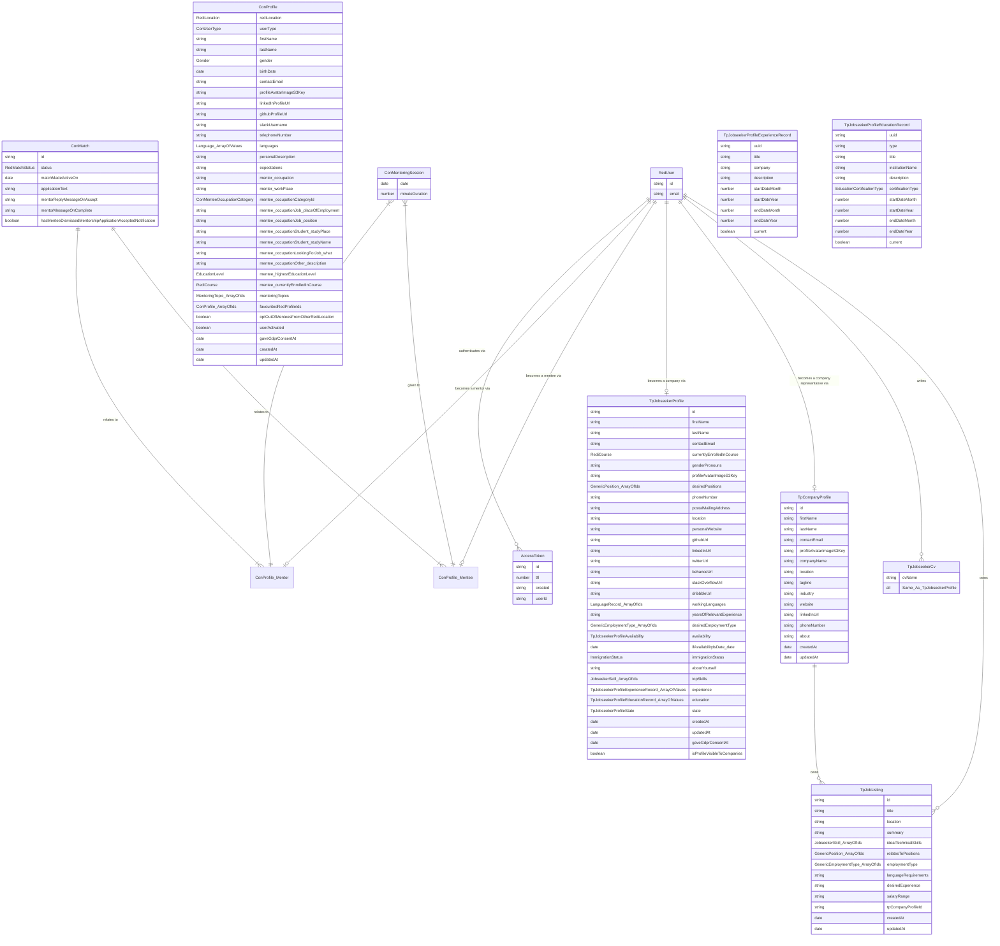

# Data models in ReDI Connect (CON) and Talent Pool (TP)

> **TL;DR: this is an ER diagram of all CON/TP data models with companion notes. Use it to understand the "status quo" and to plan for how we'll migrate them into Salesforce.**

To view the below bumbo-jumbo visually as a ER (Entity-Relationship) diagram, please [install this browser extension](https://chrome.google.com/webstore/detail/markdown-diagrams/pmoglnmodacnbbofbgcagndelmgaclel/related).

## Static data lists
(...used in dropdowns, checkboxes, blabla)

- ConMenteeOccupationCategory
- ConUserType
- DesiredEmploymentType
- EducationCertificationType
- EducationLevel
- Gender
- GenericEmploymentType
- GenericPosition
- ImmigrationStatus
- JobseekerEducationRecord
- JobseekerExperienceRecord
- JobseekerLanguageRecord
- JobseekerSkill
- Language
- MentoringTopic
- MentoringTopicGroup
- RediCourse
- RediLocation
- RedMatchStatus
- TpJobseekerProfileAvailability
- TpJobseekerProfileState

## Notes

- `MentoringSession` > minuteDuration valid values: 15, 30, 45, 60, 75, 90, 105, 120, 135, 150, 165, 180

## Static lists

| ConMenteeOccupationCategory |
| --------------------------- |
| id: job, label: Job (full-time/part-time)
| id: student, label: Student (enrolled at university)
| id: lookingForJob, label: Looking for a job
| id: other, label: Other

| ConUserType |
| --------------------------- |
| mentor
| mentee
| public-sign-up-mentor-pending-review
| public-sign-up-mentee-pending-review
| public-sign-up-mentor-rejected
| public-sign-up-mentee-rejected

| EducationCertificationType |
| --------------------------- |
| id: confirmationOfAttendance, label: Confirmation of attendance
| id: professionalCertification, label: Professional certification
| id: rediSchoolCourse, label: ReDI School Course
| id: universityDegreeDiploma, label: University degree / diploma
| id: other, label: Other

| EducationLevel |
| --------------------------- |
| id: middleSchool, label: Middle School
| id: highSchool, label: High School
| id: apprenticeship, label: Apprenticeship
| id: universityBachelor, label: University Degree (Bachelor)
| id: universityMaster, label: University Degree (Master)
| id: universityPhd, label: University Degree (PhD)

| Gender |
| -------------- |
| id: male, label: Male
| id: female, label: Female
| id: other, label: Other

| GenericEmploymentType |
| --------------------------- |
| id: partTimeEmployment, label: Part-time employment
| id: fullTimeEmployment, label: Full-time employment
| id: werkstudium, label: Werkstudent*in (working student position)
| id: internship, label: Internship
| id: apprenticeship, label: Apprenticeship (Ausbildung)
| id: selfEmployed, label: Self-employed
| id: freelance, label: Freelance
| id: contract, label: Contract
| id: traineeship, label: Traineeship

| GenericPosition |
| --------------------------- |
  {
		id: 'administrativeAssistant',
		label: 'Administrative Assistant',
	},
	{
		id: 'agileScrumCoach',
		label: 'Agile/SCRUM Coach',
	},
	{
		id: 'azureSpecialist',
		label: 'Azure Specialist',
	},
	{
		id: 'backendDeveloper',
		label: 'Backend Developer',
	},
	{
		id: 'blockchainDeveloper',
		label: 'Blockchain Developer',
	},
	{
		id: 'businessAnalyst',
		label: 'Business Analyst',
	},
	{
		id: 'cloudEngineer',
		label: 'Cloud Engineer'
	},
	{
		id: 'cloudSpecialist',
		label: 'Cloud Specialist'
	},
	{
		id: 'dataAnalyst',
		label: 'Data Analyst',
	},
	{
		id: 'dataScientist',
		label: 'Data Scientist',
	},
	{
		id: 'devOpsSpecialist',
		label: 'DevOps Specialist',
	},
	{
		id: 'digitalMarketer',
		label: 'Digital Marketer',
	},
	{
		id: 'frontendDeveloper',
		label: 'Frontend Developer',
	},
	{
		id: 'fullstackDeveloper',
		label: 'Fullstack Developer',
	},
	{
		id: 'itAdministrator',
		label: 'IT Administrator'
	},
	{
		id: 'itSpecialist',
		label: 'IT Specialist'
	},
	{
		id: 'itSupportTechnician',
		label: 'IT Support Technician'
	},
	{
		id: 'javaDeveloper',
		label: 'Java Developer',
	},
	{
		id: 'linuxSystemAdministrator',
		label: 'Linux System Administrator'
	},
	{
		id: 'marketingAssistant',
		label: 'Marketing Assistant'
	},
	{
		id: 'mobileDeveloperAndroid',
		label: 'Mobile Developer (Android)'
	},
	{
		id: 'mobileDeveloperIos',
		label: 'Mobile Developer (iOS)'
	},
	{
		id: 'nodeJsDeveloper',
		label: 'Node.js Developer',
	},
	{
		id: 'operationsManager',
		label: 'Operations Manager',
	},
	{
		id: 'productDesigner',
		label: 'Product Designer',
	},
	{
		id: 'productManager',
		label: 'Product Manager',
	},
	{
		id: 'projectAssistant',
		label: 'Project Assistant',
	},
	{
		id: 'projectManager',
		label: 'Project Manager',
	},
	{
		id: 'pythonDeveloper',
		label: 'Python Developer',
	},
	{
		id: 'qaEngineer',
		label: 'QA Engineer',
	},
	{
		id: 'reactDeveloper',
		label: 'React Developer',
	},
	{
		id: 'requirementsEngineer',
		label: 'Requirements Engineer',
	},
	{
		id: 'salesforceAdministrator',
		label: 'Salesforce Administrator',
	},
	{
		id: 'salesManager',
		label: 'Sales Manager',
	},
	{
		id: 'securityAdministrator',
		label: 'Security Administrator',
	},
	{
		id: 'SEO Manager',
		label: 'SEO Manager',
	},
	{
		id: 'systemEngineer',
		label: 'System Engineer',
	},
	{
		id: 'technicalArchitect',
		label: 'Technical Architect',
	},
	{
		id: 'uiDesigner',
		label: 'UI Designer',
	},
	{
		id: 'uiDeveloper',
		label: 'UI Developer',
	},
	{
		id: 'uiUxDesigner',
		label: 'UI/UX Designer',
	},
	{
		id: 'usabilityengineer',
		label: 'Usability Engineer',
	},
	{
		id: 'userResearcher',
		label: 'User Researcher',
	},
	{
		id: 'uxDesigner',
		label: 'UX Designer',
	}

| ImmigrationStatus |
| --------------------------- |
| label: EU-Citizenship or unlimited residence permission (Niederlassungserlaubnis), id: euCitizenshipOrUnlimitedResidencePermissionNiederlassungserlaubnis
| label: EU Blue card (Blaue Karte), id: euBlueCardBlaueKarte
| label: Temporary residence permission (Aufenthaltstitel), id: temporaryResidencePermissionAufenthaltstitel
| label: Visa (Nationalvisum or Jobseeker visum), id: visaNationalvisumOrJobseekerVisum
| label: Student visa, id: studentVisa
| label: Schengen visa, id: schengenVisa

| Language |
| -------- |
| Afrikaans
| Albanian
| Amharic
| ... (about 140 values)
| Yucatec
| Zapotec
| Zulu

| MentoringTopic |
| -------------- |
| id: basicProgrammingSkills, group: softwareEngineering, label: Basic Programming Skills
| id: htmlCss, group: softwareEngineering, label: HTML & CSS
| ... (around 40 values)
| id: motivationAndEncouragement, group: other, label: Motivation & encouragement
| id: friendAndHelp, group: other, label: Be a friend and help

| MentoringTopicGroup |
| ------------------- |
| id: softwareEngineering, label: 👩‍💻 Software Engineering
| id: design, label: 👩‍💻 Software Engineering
| id: language, label: 🏄‍♀️ Other Professions
| id: otherProfessions, label: ✋ Career Support
| id: careerSupport, label: 🗣️ Language Support
| id: other, label: 🤗 Other

| RediCourse |
| --------------------------- |
| id: introPython, label: Intro to Python, location: berlin,
| id: dataAnalytics, label: Data Analytics, location: berlin,
| id: htmlCss, label: HTML & CSS, location: berlin,
| id: javaScript, label: JavaScript, location: berlin,
| id: react, label: React, location: berlin,
| id: introJava, label: Intro to Java, location: berlin,
| id: intermediateJava, label: Programming with Java, location: berlin,
| id: introComputerScience, label: Intro to Computer Science, location: berlin,
| id: salesforceFundamentals, label: Salesforce Fundamentals, location: berlin,
| id: azureFundamentals, label: Azure Fundamentals, location: berlin,
| id: webDesignFundamentals, label: Web Design Fundamentals, location: berlin,
| id: uiUxDesign, label: UX/UI Design, location: berlin,
| id: alumni, label: I'm a ReDI School alumni (I took a course before), location: berlin,
| id: munich_dcp_spring2021_introductionToComputerScience, label: Introduction to computer science, location: munich,
| id: munich_dcp_spring2021_pythonIntermediate, label: Python Intermediate, location: munich,
| id: munich_dcp_spring2021_frontEndDevelopment, label: Front-end development, location: munich,
| id: munich_dcp_spring2021_react, label: React, location: munich,
| id: munich_dcp_spring2021_backendDevelopment, label: Back-end development, location: munich,
| id: munich_dcp_spring2021_dataScience, label: Data Science, location: munich,
| id: munich_dcp_spring2021_cloudComputing, label: Cloud computing, location: munich,
| id: munich_alumni, label: I'm a ReDI School alumni (I took a course before), location: munich,
| id: nrw_webDesignFundamentals, label: Web Design Fundamentals, location: nrw,
| id: nrw_htmlCsss, label: HTML & CSS, location: nrw,
| id: nrw_introductionToPython, label: Introduction to Python, location: nrw,
| id: nrw_networkingFundamentals, label: Networking Fundamentals, location: nrw,
| id: nrw_alumni, label: I'm a ReDI School alumni (I took a course before), location: nrw,

| RediLocation |
| ------------ |
| berlin
| munich
| nrw

| RedMatchStatus |
| -------------- |
| applied
| invalidated-as-other-mentor-accepted
| accepted
| completed
| cancelled

| TpJobseekerProfileAvailability |
| --------------------------- |
| id: immediately, label: Immediately
| id: oneMonthNotice, label: One month notice
| id: twoMonthNotice, label: Two months notice
| id: threeMonthNotice, label: Three months notice
| id: date, label: Date

## Questions
## Milestones

- few
- fewfwe
- fewifjwoieffwe

## Ideas

Move some ConProfile fields into some kind of "User settings" object?
