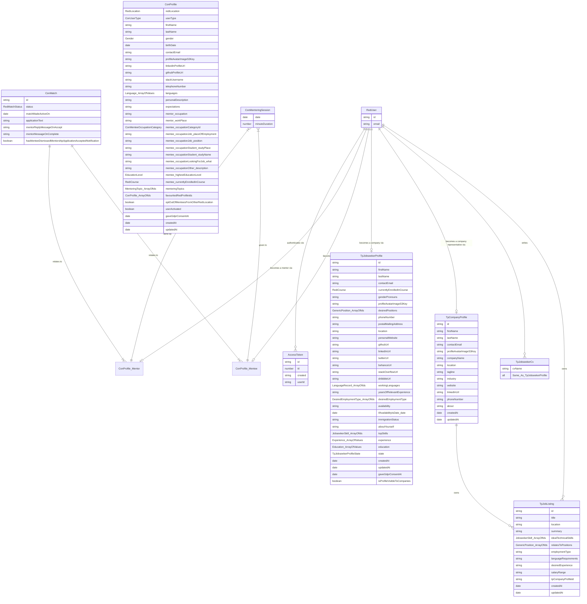

# Data models in ReDI Connect (CON) and Talent Pool (TP)

TL;DR: this is an ER diagram of all CON/TP data models. Use it to understand the "status quo" and plan for how we'll migrate them into Salesforce.

Last updated: 21 July 2021

## Notes

- `MentoringSession` > minuteDuration valid values: 15, 30, 45, 60, 75, 90, 105, 120, 135, 150, 165, 180

## Static lists

| RediLocation |
| ------------ |
| berlin
| munich
| nrw

| RedMatchStatus |
| -------------- |
| applied
| invalidated-as-other-mentor-accepted
| accepted
| completed
| cancelled

| ConMenteeOccupationCategory |
| --------------------------- |
| id: job, label: Job (full-time/part-time)
| id: student, label: Student (enrolled at university)
| id: lookingForJob, label: Looking for a job
| id: other, label: Other

| Language |
| -------- |
| Afrikaans
| Albanian
| Amharic
| ... (about 140 values)
| Yucatec
| Zapotec
| Zulu

| MentoringTopicGroup |
| ------------------- |
| id: softwareEngineering, label: 👩‍💻 Software Engineering
| id: design, label: 👩‍💻 Software Engineering
| id: language, label: 🏄‍♀️ Other Professions
| id: otherProfessions, label: ✋ Career Support
| id: careerSupport, label: 🗣️ Language Support
| id: other, label: 🤗 Other

| MentoringTopic |
| -------------- |
| id: basicProgrammingSkills, group: softwareEngineering, label: Basic Programming Skills
| id: htmlCss, group: softwareEngineering, label: HTML & CSS
| ... (around 40 values)
| id: motivationAndEncouragement, group: other, label: Motivation & encouragement
| id: friendAndHelp, group: other, label: Be a friend and help

## Questions
## Milestones

- few
- fewfwe
- fewifjwoieffwe

## Ideas

Move some ConProfile fields into some kind of "User settings" object?
